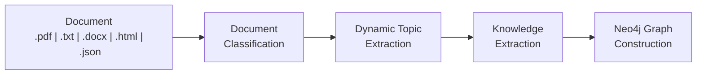

# Market Foundry: From Documents to Intelligence – Built Your Way  
**Authors:** Jessica Batbayar, Matthew Wong, Marija Vukic  
**[Project Website](https://jessicabat.github.io/market-foundry/)**

## Contributions  
All authors collaborated continuously through pair programming. Together, we designed the workflow, implemented the extraction pipeline, configured models, debugged code, set up Neo4j, ran experiments, and authored all documentation. Every component of the project was developed collaboratively, with equal contributions from each author in design, execution, and analysis.

## Acknowledgements  
We gratefully acknowledge the **OneKE** repository and its authors for enabling this work. We leveraged **OneKE** to extract structured knowledge from financial papers, making it possible to build a comprehensive knowledge graph.

- [OneKE](https://github.com/OpenSPG/OneKE)

---

## Table of Contents  
- [API vs Local: Which Should I Use?](#api-vs-local-which-should-i-use)
- [API Documentation](#api-documentation)
  - [How it works](#how-it-works)
  - [Endpoints](#endpoints)
  - [Usage](#usage)
  - [Get a free Neo4j instance](#get-a-free-neo4j-instance)
  - [Deploy your own API instance](#deploy-your-own-api-instance)
- [Local Setup](#local-setup)
  - [Introduction](#introduction)
  - [Workflow Overview](#workflow-overview)
  - [Directory Structure](#directory-structure)
  - [Setup Instructions](#setup-instructions)
  - [Customizations](#customizations)
  - [Running Market Foundry Pipeline](#running-market-foundry-pipeline)
  - [Pipeline Outputs](#pipeline-outputs)
  - [Final Thoughts](#final-thoughts)

---

## API vs Local: Which Should I Use?

| | **API** | **Local** |
|---|---|---|
| **Setup time** | ~1 minute | 15–30 minutes |
| **GPU required** | No — runs on Modal's serverless GPU | Yes — recommended for reasonable speed |
| **Cost** | $0 to start (Modal free tier) | Your own compute costs |
| **Best for** | Quick integration, production use, no infrastructure management | Research, customization, running your own model |
| **Model** | Qwen2.5-1.5B-Instruct (hosted) | Any supported Hugging Face or API model |
| **Neo4j** | Bring your own (BYOD) | Local or remote Neo4j instance |

**Use the API if** you want to start extracting knowledge graphs immediately without setting up a GPU environment, managing dependencies, or hosting a model. Just send a document, get back triples.

**Use local setup if** you want full control over the model, need to customize the extraction pipeline, or are running experiments that require reproducibility over a specific model configuration.

---

## API Documentation

> **Live endpoint:** `https://marija-vukic--market-foundry-api-fastapi-app.modal.run`  
> **Interactive docs:** `https://marija-vukic--market-foundry-api-fastapi-app.modal.run/docs`  
> **Stack:** Modal (serverless GPU) · FastAPI · Neo4j AuraDB  
> **Cost:** $0 to start

### How it works

MarketFoundry is an **open-source, API-first knowledge extraction engine** that converts any financial document format into queryable knowledge graphs.

It provides the **compute and intelligence layer** — document classification, sectioning, and causal triple extraction via OneKE + Qwen.

**Build Your Own Database.** Pass your Neo4j AuraDB credentials with each request and extracted triples are written directly to your own graph instance. No credentials? No problem — results are still returned as JSON.

```
Your Document
     ↓
MarketFoundry API (Modal GPU)
  → classify → section → extract triples
     ↓                        ↓
  JSON response         Your Neo4j instance
                        (optional, yours only)
```

---

### Endpoints

| Method | Path | Description |
|--------|------|-------------|
| `POST` | `/process` | Upload document + optional Neo4j credentials → extract knowledge graph |
| `GET`  | `/result/{job_id}` | Poll for results from a submitted job |
| `POST` | `/query` | Run a read-only Cypher query against your own Neo4j instance |
| `GET`  | `/health` | Liveness check |
| `GET`  | `/docs` | Swagger UI |

---

### Usage

#### 1. Submit a job

**Without Neo4j (JSON output only):**

```bash
curl -X POST "https://marija-vukic--market-foundry-api-fastapi-app.modal.run/process" \
  -F "file=@/path/to/your/document.pdf"
```

**With your own Neo4j (triples also written to your graph):**

```bash
curl -X POST "https://marija-vukic--market-foundry-api-fastapi-app.modal.run/process" \
  -F "file=@/path/to/your/document.pdf" \
  -F "neo4j_uri=neo4j+s://xxxx.databases.neo4j.io" \
  -F "neo4j_username=neo4j" \
  -F "neo4j_password=yourpassword"
```

Response:
```json
{
  "job_id": "fc-JobID",
  "status": "processing",
  "poll_url": "/result/fc-JobID",
  "message": "Job started for 'document.pdf'. Poll /result/fc-JobID to get results."
}
```

#### 2. Poll for results

```bash
curl "https://marija-vukic--market-foundry-api-fastapi-app.modal.run/result/fc-JobID"
```

While running:
```json
{"status": "processing", "message": "Still running, check back soon."}
```

When complete:
```json
{
  "status": "complete",
  "result": {
    "filename": "document.pdf",
    "document_type": "Earnings Call Transcript",
    "triples": [
      {
        "head": "Apple Inc.",
        "head_type": "company",
        "relation": "reported",
        "relation_type": "financial_result",
        "tail": "record quarterly revenue of $124.3 billion",
        "tail_type": "financial_metric"
      }
    ],
    "triple_count": 1,
    "neo4j_relationships_written": 1,
    "neo4j_used": true,
    "status": "success"
  }
}
```

#### 3. Query your graph (optional)

Once triples are written to Neo4j, you can query your graph directly via the API:

```bash
curl -X POST "https://marija-vukic--market-foundry-api-fastapi-app.modal.run/query" \
  -F "cypher=MATCH (s)-[r]->(o) RETURN s.name, type(r), o.name LIMIT 25" \
  -F "neo4j_uri=neo4j+s://xxxx.databases.neo4j.io" \
  -F "neo4j_username=neo4j" \
  -F "neo4j_password=yourpassword"
```

Response:
```json
{
  "results": [
    {"s.name": "Apple Inc.", "type(r)": "REPORTED", "o.name": "record quarterly revenue"}
  ],
  "count": 1
}
```

> Only `MATCH` and `CALL` queries are permitted — the endpoint is read-only.

**Supported file formats:** `.pdf`, `.docx`, `.txt`, `.html`, `.json`

---

### Get a free Neo4j instance

1. Go to [neo4j.com/cloud/aura](https://neo4j.com/cloud/aura/)
2. Sign up and click **Create Free Instance**
3. Save the URI, username, and password shown — **password is only displayed once**

Free tier: 200k nodes, 400k relationships, $0/month.

---

### Deploy your own API instance

```bash
pip install modal
modal setup
modal deploy src/api/modal_app.py
```

No secrets needed — just Modal login. Users supply their own Neo4j credentials per request.

---

## Local Setup

### Introduction  
Unstructured financial text such as regulatory filings, earnings call transcripts, news articles, research reports, and internal analyses, contains critical context about real-world market events and decision drivers. However, this information is typically processed in isolation through summarization, sentiment scoring, or event tagging, leaving relationships across documents, time, and market actors disconnected. As a result, valuable narrative and causal context often remains inaccessible to the analytical tools and models that rely on structured data representations.

Market Foundry addresses this by providing a reproducible, modular pipeline that classifies documents, extracts structured triples, and constructs a queryable knowledge graph in Neo4j. We use **OneKE**, an open-source framework, to drive entity and relationship extraction through a pipeline that includes document classification, dynamic topic extraction, and schema-guided semantic understanding. 

To reproduce our results, users can choose between:  
- A `conda` environment setup  
- A `Docker` containerized setup  

First, clone the repository and ensure that Docker Desktop or conda is installed. Then, follow the instructions below to set up your environment and run the pipeline.

---

### Workflow Overview  


---

### Directory Structure  
We organized our codebase into the following structure for clarity and modularity:
- OneKE codebase: `OneKE`: (cloned from the original repository, with modifications for our use case)
- Main pipeline code: `src/`:  
  - `run.py`: Main script to execute the pipeline  
  - `topic_extractor.py`: Code related to dynamic topic extraction and classification
  - `yaml_generator.py`: Code for generating YAML configuration files based on the topic extraction results
  - `utils/`: Utility functions and configuration files  
    - `extraction_config.yaml`: Configuration for model selection, database connection, and extraction parameters
  - `models/`: Code related to TFIDF model loading and inference
  - `knn_pipeline/`: Code related to KNN-based retrieval
- `Configs/`: Base configuration files for the project. If `topic_extractor.py` and `yaml_generator.py` fail these are the fallback configs that will be used for extraction.
- `Papers/`: Financial documents for testing the pipeline (126 files across earnings call transcripts, SEC filings, press releases, research papers, and news articles)
- `Results/`: Output results from running the pipeline
  - `construct.py`: Script to construct the Neo4j graph from extracted triples (can be run separately if needed)
  - `extraction_results.json`: Extracted triples from the documents
- `docs/`: Website documentation files
- `evaluation_notebook.ipynb`: Notebook for evaluating the document classifier model
- Setup Files:
  - `requirements.txt`: Python dependencies for the project
  - `environment.yml`: Conda environment configuration
  - `Dockerfile`: Docker configuration for containerized setup

---

## Setup Instructions  

Key dependencies are pinned below. The full list is in `requirements.txt` and `environment.yml`.

| Package | Version | Purpose |
|---|---|---|
| `python` | 3.12.12 | Runtime |
| `torch` | 2.4.0 | Model inference |
| `transformers` | 4.44.0 | Hugging Face model loading |
| `accelerate` | 1.1.1 | GPU/CPU inference acceleration |
| `sentence-transformers` | 3.3.0 | KNN-based retrieval |
| `langchain` | 0.3.3 | Document loading and chaining |
| `neo4j` | 5.28.1 | Knowledge graph construction |
| `openai` | 1.55.3 | API-based model support |
| `pdfplumber` | 0.11.9 | PDF document parsing |
| `scikit-learn` | 1.6.1 | TF-IDF and KNN models |
| `numpy` | 1.26.4 | Numerical operations |
| `pandas` | 2.2.3 | Data handling |

### Two Options for Environment Setup  
We offer two methods to set up your environment: a **conda** environment or a **Docker** container.

#### Conda Environment Setup  

The `environment.yml` file defines all required dependencies. Use this option if you want an identical setup to our experimental environment.

Navigate to the root directory of the repository and run:

```bash
conda env create -f environment.yml
conda activate <environment_name>
```

By default, the environment is named `market-foundry`. You can customize this name in the `environment.yml` file if preferred.

#### Docker Setup  

Navigate to the root directory of the repository and execute the following commands to build the image and launch a container:

```bash
docker build -t market-foundry .
# For Mac/Linux
docker run -v $(pwd):/app market-foundry
# For Windows PowerShell
docker run -v ${PWD}:/app market-foundry
```

#### For Users with an NVIDIA GPU  

To enable GPU acceleration, use the NVIDIA runtime:

```bash
docker run --gpus all -v $(pwd):/app market-foundry
```

#### Neo4j Database Setup  

To build the knowledge graph, you must have a running instance of **Neo4j**. You can set up your Neo4j instance in two ways: via **Neo4j Aura (Remote)** or **Neo4j (Local)**.

1. **Neo4j Aura (Remote)**  
   - Sign up for a free account at [Neo4j Aura](https://neo4j.com/cloud/aura/).  
   - Create a new database instance and note your **database ID**, **username**, and **password**.  

2. **Neo4j (Local)**  
   - (Optional) Install Neo4j locally by following the instructions at [Neo4j Downloads](https://neo4j.com/download/).  
   - Start the Neo4j server and record your **username** and **password**.

In the `construct` section of the schema configuration found in `src/utils/extraction_config.yaml`, provide your database URL, username, and password. Neo4j can be launched locally (via Docker) or accessed remotely through the cloud.

Below are two example `construct` configuration blocks for connecting to a Neo4j database. Choose one based on your setup and replace the placeholder values with your actual credentials.

#### Neo4j Aura Example (Remote)  

```yaml
construct: # Required for knowledge graph construction  
  database: Neo4j  
  url: neo4j+s://<database-id>.databases.neo4j.io  
  username: neo4j  # Default username is neo4j
  password: <database_password> # Your Neo4j Aura database password
```

#### Neo4j Local Example (On-Device)  

```yaml
construct: # Required for knowledge graph construction  
  database: Neo4j  
  url: bolt://localhost:7687  # Default port is 7687  
  username: neo4j  # Default username is neo4j
  password: <database_password> # Your Neo4j Local database password
```

---

## Customizations

### Model Selection  

OneKE by default supports the following model APIs:
1. **LocalServer** (e.g., LM Studio, Ollama, vLLM, Llama.cpp)  
2. **OpenAI**  
3. **DeepSeek**

> **Note:** The chosen **LocalServer** must have an OpenAI-compatible API for seamless integration with OneKE. We used **LM Studio** in our experiments, but you can use any LocalServer that meets this requirement.

In addition to the default APIs, OneKE also supports the following model categories from Hugging Face:
1. **LLaMA**  
2. **Qwen**  
3. **ChatGLM**  
4. **MiniCPM**  
5. **DeepSeek-R1**

> **Note:** OneKE's own model does *not* support triple extraction, so we did not include it in the list of supported models for our use case. However, you can still use it for other tasks OneKE supports, such as Named Entity Recognition (NER), Relation Extraction (RE), and Event Extraction (EE).

In `src/utils/extraction_config.yaml`, you can specify any Hugging Face model from the supported categories listed above. Update the `category` and `model_name_or_path` fields in the `model` section of the configuration. If you choose an API-based model (e.g., LocalServer, OpenAI, DeepSeek), include the necessary authentication credentials (e.g., API key) and base URL if applicable.

### Example Model Configuration Using LocalServer  

```yaml
model:
  category: LocalServer
  model_name_or_path: "qwen/qwen3-4b-2507" # The model identifier.
  api_key: LM_Studio # Include a value even though LM Studio does not require an API key, to avoid errors in the code that expects this field.
  base_url: http://127.0.0.1:1234 # The default port for LM Studio. 
```

For safety, we recommend using environment variables to store sensitive information such as API keys and database credentials. You can set these in your terminal or include them in a `.env` file (ensure it is added to `.gitignore` to prevent accidental commits).

### Example Model Configuration Using Hugging Face  

```yaml
model:
  category: Qwen # Chosen from the list of supported Hugging Face model categories.
  model_name_or_path: "Qwen/Qwen3-4B-Instruct-2507" # The model identifier on Hugging Face.
  api_key: ""
  base_url: ""
```

---

## Running Market Foundry Pipeline  

After activating your environment or launching the Docker container, run the pipeline using `src/run.py`.

We used **[Qwen3-4B-Instruct-2507](https://huggingface.co/Qwen/Qwen3-4B-Instruct-2507)** from Hugging Face, an open-source, instruction-tuned model well suited for financial document understanding. This model performs well at interpreting complex text and extracting relevant entities and relationships.

> **Important:** Some models on Hugging Face require authentication. To access them:  
> 1. Log in to your Hugging Face account.  
> 2. Go to Settings → Access Tokens → Create a new token with *read* permissions.  
> 3. Run the following command and enter your token when prompted:

```bash
hf auth login
```

Once authenticated, you are ready to run the pipeline.

> **Dataset:** Sample financial documents are provided in the Papers/ folder. You can also supply your own documents — the pipeline accepts .pdf, .txt, .docx, .html, and .json files.

### Two Execution Methods  

1. **Run with a single file**  

```bash
python src/run.py --file <path_to_document>
```

2. **Run with all files in a folder**  

```bash
python src/run.py --folder <path_to_folder>
```

> **Note:** When the pipeline completes, extracted knowledge will be printed in the terminal. The results can optionally be pushed to Neo4j and visualized in the **Explore** tab of your instance.

---

## Pipeline Outputs
After running the pipeline, you will see outputs similar to the following in your terminal:

```json
Extraction Result:
  {
    "triple_list": [
      {
        "head": "Company A",
        "head_type": "Company",
        "relation": "acquired",
        "relation_type": "corporate_transaction",
        "tail": "Company B",
        "tail_type": "Company"
      },
      {
        "head": "Company A",
        "head_type": "Company",
        "relation": "reported",
        "relation_type": "updates_financial_position",
        "tail": "quarterly revenue growth",
        "tail_type": "Financial Metric"
      },
      {
        "head": "Company A",
        "head_type": "Company",
        "relation": "launched",
        "relation_type": "product_development",
        "tail": "a new financial platform",
        "tail_type": "Product"
      }
    ]
  }
```

These extracted triples are automatically saved to `Results/extraction_results.json` after each run. To construct the Neo4j knowledge graph from a previous extraction, run `Results/construct.py` separately:

```bash
python Results/construct.py
```

---

## Final Thoughts  

This pipeline provides a reproducible framework for transforming unstructured financial documents into structured knowledge graphs. Its modular design allows flexible model selection, deployment configuration, and database integration across environments.
